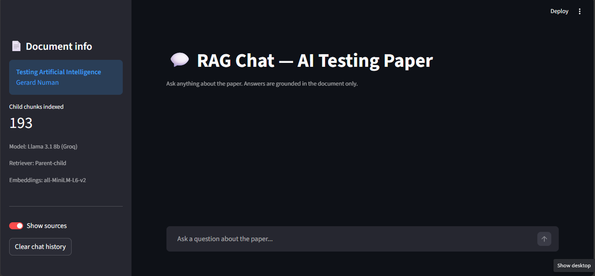
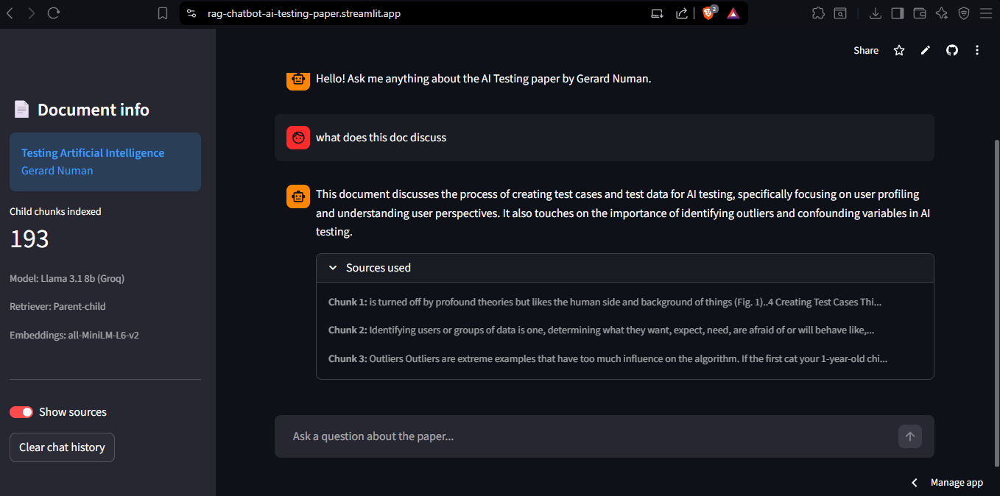
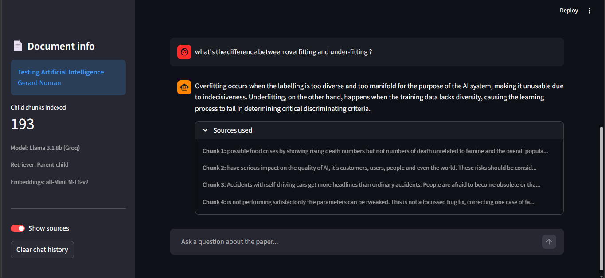

# RAG Chat — AI Testing Paper

A Retrieval-Augmented Generation (RAG) chatbot built entirely with free tools.
Ask questions about the paper *Testing Artificial Intelligence* by Gerard Numan
and get answers grounded in the document.

## Screenshots

### App loaded


### Summary question


### Overfitting vs underfitting


## Stack
- **Embeddings**: sentence-transformers/all-MiniLM-L6-v2 (local, free)
- **Vector store**: ChromaDB
- **Retriever**: LangChain ParentDocumentRetriever
- **LLM**: Llama 3.1 8b via Groq API (free tier)
- **UI**: Streamlit

## RAGAS evaluation scores
| Metric | Score |
|---|---|
| Faithfulness | 1.00 |
| Answer relevancy | 0.85 |
| Context recall | 0.75 |

## Run locally

1. Clone the repo
2. Install dependencies: `pip install -r requirements.txt`
3. Add your Groq API key to `.streamlit/secrets.toml`:
```toml
   GROQ_API_KEY = "your_key_here"
```
4. Run: `streamlit run app.py`

## Deploy on Streamlit Cloud
Add `GROQ_API_KEY` in the Streamlit Cloud secrets manager
(App settings → Secrets).